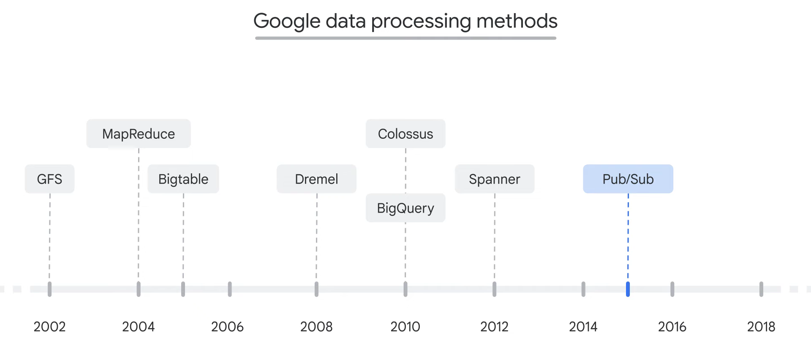
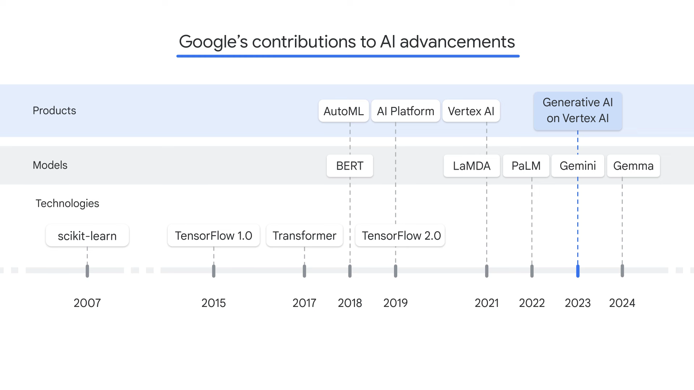

# **AI/ML Architecure on Google Cloud**

**Why should we trust on Google Cloud?**
* An AI-first company since the beginning.
* `Google` is a leader in AI and ML Innovations.
* `Google` is a believer in responsible AI.

<!--  -->

Google integrated responsible AI into its AI principles.
**`Responsible AI`** refers to the development and use of AI systems in a way that prioritizes ethical considerations, fairness, accountability, safety and transparency.

There are 7 AI principles to guide its work:
* AI should be socially beneficial.
* AI should avoid creating or reinforcing unfair bias.
* AI should be built and tested for safety.
* AI should incorporate privacy design principles.
* AI should uphold high standards of scientific excellence.
* AI should be accountable to people.
* AI should be made available for uses that accord with these principles.